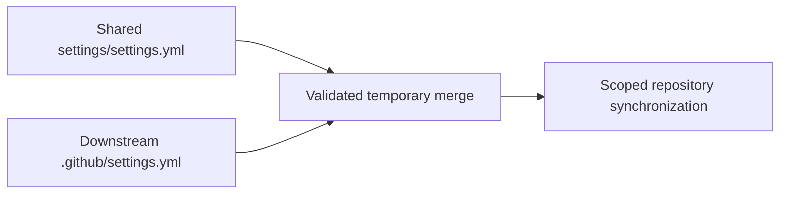

```mermaid
flowchart LR
  defaults["Shared settings/settings.yml"] --> merge["Validated temporary merge"]
  project["Downstream .github/settings.yml"] --> merge
  merge --> sync["Scoped repository synchronization"]
```
